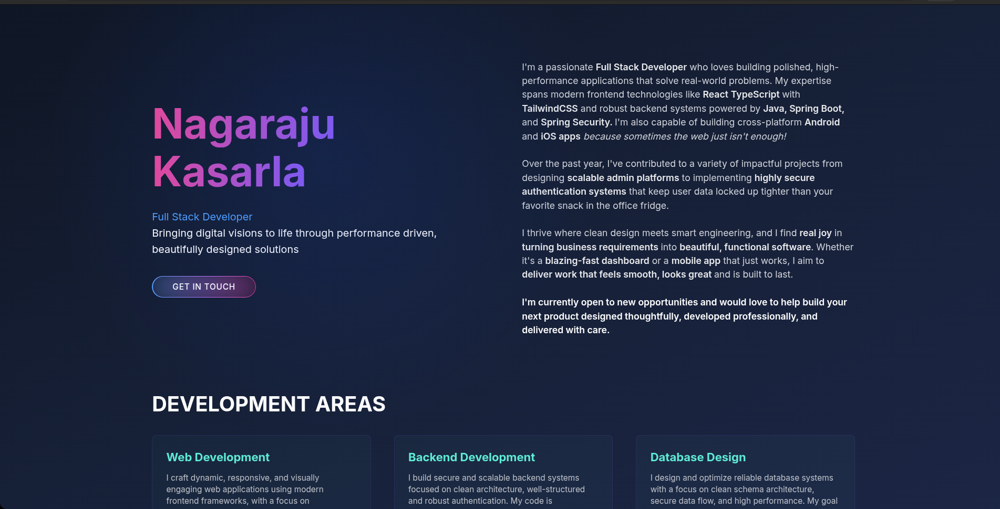

# Modern Portfolio Website

  

  

## 🚀 About The Project

A modern, responsive portfolio website built with React, TypeScript, and Vite. It features a sleek, professional design with interactive UI elements, optimized performance, and responsive layouts for all device sizes. The portfolio showcases projects, services, and personal information in an engaging and visually appealing manner.

## ✨ Key Features

- **Modern Design**: Dark theme with gradient accents and interactive elements
- **Mouse-Following Glow**: Interactive cursor effect with subtle radial gradient
- **Responsive Images**: Optimized image loading with different sizes for various devices
- **Performance Optimized**: Advanced build optimizations and code splitting
- **Interactive UI**: Custom animations and smooth transitions
- **Contact Form**: Server-less email functionality using EmailJS
- **Accessibility**: Built with a focus on web accessibility standards

## 🛠️ Built With

### Core Technologies

- **React 19**: Latest version with improved performance
- **TypeScript**: For type safety and better developer experience
- **Vite**: Fast, modern build tool and development server
- **Tailwind CSS 4**: Utility-first CSS framework

### Optimization Tools

- **vite-plugin-imagemin**: Image optimization
- **Code Splitting**: Optimized chunk management
- **Source Maps**: Enabled for production debugging

### Development Tools

- **ESLint**: Code quality and consistency
- **Prettier**: Code formatting
- **TypeScript ESLint**: Type-aware linting

### SEO Optimization

- **Comprehensive Meta Tags**: Complete set of meta tags for better search engine visibility
- **Structured Data**: JSON-LD structured data for Person, WebSite, and BreadcrumbList
- **Open Graph & Twitter Cards**: Enhanced social media sharing capabilities
- **Sitemap**: XML sitemap with image support for better indexing
- **Robots.txt**: Optimized robots.txt with crawl instructions
- **Performance Optimizations**: Preconnect and DNS prefetch for faster loading
- **Progressive Web App**: Web app manifest for installable experience
- **Accessibility**: Proper language attributes and semantic HTML
- **Security Headers**: Content Security Policy and other security headers
- **humans.txt & security.txt**: Additional standard web files
